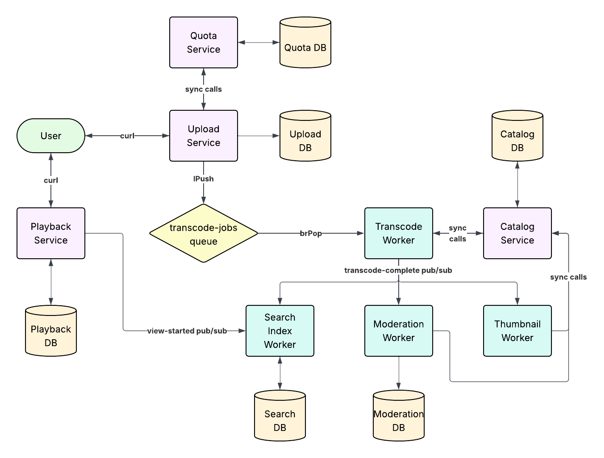

# Team 6 - Video Processing Pipeline 

**Course:** COMPSCI 426  
**Team:** Anne-Colombe Sinkpon, Duyen Tran, Zoë Akpan, Jihyun Kim, Nishil Adina, Gabriella Wang, Jahnavi Sharma  
**System:** Video Processing Pipeline  
**Repository:** GitHub URL — public fork of https://github.com/umass-cs-426/starter-project --> Group repo = https://github.com/ZoeAkpan/team-6-video-processing 



## Team and Service Ownership

| Team Member | Services / Components Owned                             |
| ----------- | ------------------------------------------------------  |
|  Anne-Colombe Sinkpon | [`upload-service/`, `thumbnail-worker`]       |
|  Duyen Tran           | [`catalog-service`]                           |
|  Zoë Akpan            | [`upload-service`, `thumbnail-worker`(can help out)]|
|  Jihyun Kim           | [`quota-service`]                             |
|  Nishil Adina         | [`moderation-worker`]     |
|  Gabriella Wang       | [`search-index-worker`]                       |
|  Jahnavi Sharma       | [`catalog-service` ]                          |
|  Robert Winfield      | [`transcode-worker`]                          |
|  Sebastian Vaskes Pimentel | [`playback-service`]                     |


> Ownership is verified by `git log --author`. Each person must have meaningful commits in the directories they claim.

---

## How to Start the System

```bash
# Start everything (builds images on first run)
docker compose up -d --build

# Start with service replicas (Sprint 4)
docker compose up -d --build --scale upload-service=3 --scale quota-service=3 --scale catalog-service=3

# Verify all services are healthy
docker compose ps

# Stream logs
docker compose logs -f

# Open a shell in the holmes investigation container
docker compose exec holmes bash
```

### Base URLs (development)
| Component | URL |
|-------------------------|-----------------------|
| Caddy load balancer     | http://localhost |
| `upload-service` via Caddy | http://localhost/upload-service |
| `quota-service` via Caddy | http://localhost/quota-service |
| `catalog-service` via Caddy | http://localhost/catalog-service |
| `playback-service`      | http://localhost:3003 |
| `transcode-worker`      | http://localhost:3004 |
| `thumbnail-worker`      | http://localhost:3005 |
| `search-index-worker`   | http://localhost:3006 |
| `moderation-worker`     | http://localhost:3007 |
| `holmes`                | (no port; access via exec) |


> From inside holmes, services are reachable by name:
> `curl http://your-service:3000/health`
>
> See [holmes/README.md](holmes/README.md) for a full tool reference.

Sprint 4 replicates `upload-service`, `quota-service`, and `catalog-service`.
Those services are stateless HTTP APIs: each replica stores durable state in its
service database or Redis, not in local process memory. `quota-service` shares
all quota state through `quota-db`, so all replicas enforce the same upload
counts and storage totals.

To verify Caddy is distributing quota traffic across replicas:

```bash
for i in $(seq 1 20); do curl -s http://localhost/quota-service/health | jq .serviceInstance; done
```

To run the Sprint 4 k6 tests from Holmes:

```bash
docker compose exec holmes bash
BASE_URL=http://caddy:80 k6 run --env SCALE=single /workspace/k6/sprint-4-scale.js
BASE_URL=http://caddy:80 k6 run --env SCALE=replicated /workspace/k6/sprint-4-scale.js
BASE_URL=http://caddy:80 k6 run /workspace/k6/sprint-4-replica.js
```

---

## System Overview

This project is a video processing pipeline made up of small services connected through Docker Compose. In Sprint 1, the main flow we have working is that a user sends an upload request to `upload-service`, and `upload-service` makes a synchronous HTTP call to `quota-service` to make sure the user is still within their upload limits. If the quota check passes, the upload record is saved in the upload database. We also have `catalog-service`, which reads video records from its own database and exposes a read endpoint for the current catalog. Redis is also running in the system and is used by services for health checks and quota-related state.

---

## API Reference

<!--
  Document every endpoint for every service.
  Follow the format described in the project documentation: compact code block notation, then an example curl and an example response. Add a level-2 heading per service, level-3 per endpoint.
-->

## upload-service

### GET /health

```
GET /health

  Returns the health status of the upload service and its dependencies:
  PostgreSQL, Redis, quota-service, and the Redis transcode queue. When the
  service is scaled, the response includes the instanceId for the replica that
  handled the request.

  Responses:
    200  Healthy — service and dependencies are reachable
    503  Service unavailable — one or more dependencies are unreachable
```

**Example request:**

```bash
curl http://localhost/upload-service/health
```

**Example response (200):**

```json
{
  "status": "healthy",
  "service": "upload-service",
  "instanceId": "55ff7b1c5928",
  "timestamp": "2026-05-03T22:16:43.122Z",
  "uptime_seconds": 42,
  "checks": {
    "database": { "status": "healthy", "latency_ms": 2 },
    "redis": { "status": "healthy", "latency_ms": 1 },
    "quotaService": { "status": "healthy", "http_status": 200 },
    "transcodeQueue": {
      "status": "healthy",
      "name": "transcode-jobs",
      "depth": 0
    }
  }
}
```

---

### POST /upload/seed
 
```
POST /upload/seed
 
  Generates 100 fake upload requests and sends each one to POST /upload.
  Useful for populating the system with test data. Each request uses a unique
  fileHash, a rotating set of content types, and one of ten seed users
  (seed-user-1 through seed-user-10). Results are tallied by outcome and
  returned in full. Failed requests are logged with event seed_upload_failed.
 
  Responses:
    200  Seed run completed — summary and per-request results returned
    500  Internal error
```
 
**Example request:**
 
```bash
curl -X POST http://localhost/upload-service/upload/seed
```
 
**Example response (200):**
 
```json
{
  "message": "Seeded 100 upload requests",
  "summary": {
    "total": 100,
    "success": 88,
    "duplicate": 0,
    "failed": 12
  },
  "results": [
    {
      "index": 1,
      "fileHash": "seed-1746312000000-0-a3f9bc12",
      "status": 201,
      "ok": true
    },
    {
      "index": 2,
      "fileHash": "seed-1746312000001-1-d7e4fa89",
      "status": 403,
      "ok": false,
      "error": "Upload blocked by quota service"
    }
  ]
}
```

---

### GET /upload/:fileHash

```
GET /upload/:fileHash

  Returns one upload record by fileHash. The lookup reads from the shared
  upload PostgreSQL database, so it works the same way when upload-service is
  running with multiple replicas.

  Path:
    fileHash  string  The upload file hash used as the upload primary key

  Responses:
    200  Success — returns the upload record
    404  Not found — no upload exists with that fileHash
    500  Internal error — database lookup failed
```

**Example request:**

```bash
curl http://localhost/upload-service/upload/a1b2c3d4e5f6a1b2c3d4e5f6a1b2c3d4e5f6a1b2c3d4e5f6a1b2c3d4e5f6a1b2
```

**Example response (200):**

```json
{
  "fileHash": "a1b2c3d4e5f6a1b2c3d4e5f6a1b2c3d4e5f6a1b2c3d4e5f6a1b2c3d4e5f6a1b2",
  "originalFilename": "vacation_hawaii.mp4",
  "contentType": "video/mp4",
  "fileSizeBytes": "1000",
  "uploadedBy": "alice@example.com",
  "duration": "1",
  "status": "queued",
  "quotaConsumed": true,
  "errorMessage": null,
  "transcodeEnqueuedAt": "2026-05-03T22:00:00.000Z",
  "createdAt": "2026-05-03T22:00:00.000Z",
  "updatedAt": "2026-05-03T22:00:00.000Z"
}
```

---

### POST /upload

```
POST /upload

  Accepts a new video upload request. This endpoint is idempotent by fileHash:
  duplicate file hashes return the existing upload instead of creating another
  record. New uploads synchronously call quota-service, write to the shared
  upload PostgreSQL database, and enqueue a transcode job in Redis.

  Body:
    originalFilename  string   required  Original uploaded file name
    contentType       string   required  MIME type for the file, such as video/mp4
    fileSizeBytes     integer  required  File size in bytes; must be greater than 0
    uploadedBy        string   required  User or account identifier for the uploader
    fileHash          string   required  Hash used for idempotency and duplicate detection
    duration          number   required  Video duration in seconds; must be greater than 0

  Responses:
    201  Created — upload was accepted, saved, quota was consumed, and a transcode job was queued
    200  Success — matching fileHash already exists and the existing upload is returned
    400  Bad request — missing fields, invalid JSON, or invalid field values
    403  Forbidden — quota-service blocked the upload or quota consumption conflicted
    503  Service unavailable — quota-service, Redis queue, or quota rollback failed
    500  Internal error — unexpected upload failure
```

**Example request:**

```bash
curl -X POST http://localhost/upload-service/upload \
  -H "Content-Type: application/json" \
  -d '{
    "originalFilename": "demo.mp4",
    "contentType": "video/mp4",
    "fileSizeBytes": 1000000,
    "uploadedBy": "user-123",
    "fileHash": "readme-upload-example-001",
    "duration": 42
  }'
```

**Example response (201):**

```json
{
  "message": "Upload accepted",
  "duplicate": false,
  "upload": {
    "fileHash": "readme-upload-example-001",
    "originalFilename": "demo.mp4",
    "contentType": "video/mp4",
    "fileSizeBytes": "1000000",
    "uploadedBy": "user-123",
    "duration": "42",
    "status": "queued",
    "quotaConsumed": true,
    "errorMessage": null,
    "transcodeEnqueuedAt": "2026-05-03T22:20:00.000Z",
    "createdAt": "2026-05-03T22:20:00.000Z",
    "updatedAt": "2026-05-03T22:20:00.000Z"
  },
  "quota": {
    "allowed": true,
    "reason": "ok",
    "userId": "user-123",
    "requestedFileSizeBytes": 1000000,
    "uploadCount": 0,
    "uploadLimitCount": 10,
    "remainingUploadSlots": 10,
    "storageUsedBytes": 0,
    "storageLimitBytes": 1073741824,
    "remainingBytes": 1073741824
  },
  "quotaConsumption": {
    "consumed": true,
    "idempotentReplay": false,
    "reason": "consumed",
    "userId": "user-123",
    "uploadCount": 1,
    "uploadLimitCount": 10,
    "remainingUploadSlots": 9,
    "storageUsedBytes": 1000000,
    "storageLimitBytes": 1073741824,
    "remainingBytes": 1072741824
  }
}
```

**Example response (200, duplicate fileHash):**

```json
{
  "message": "An upload with this file hash already exists",
  "duplicate": true,
  "fileHash": "readme-upload-example-001",
  "upload": {
    "fileHash": "readme-upload-example-001",
    "originalFilename": "demo.mp4",
    "contentType": "video/mp4",
    "fileSizeBytes": "1000000",
    "uploadedBy": "user-123",
    "duration": "42",
    "status": "queued",
    "quotaConsumed": true,
    "errorMessage": null,
    "transcodeEnqueuedAt": "2026-05-03T22:20:00.000Z",
    "createdAt": "2026-05-03T22:20:00.000Z",
    "updatedAt": "2026-05-03T22:20:00.000Z"
  }
}
```

## quota-service

### GET /health

```
GET /health

  Returns the health status of the quota service, PostgreSQL, and Redis.

  Responses:
    200  Service and dependencies healthy
    503  One or more dependencies unreachable
```

**Example request:**

```bash
curl http://localhost/quota-service/health
```

**Example response (200):**

```json
{
  "status": "healthy",
  "service": "quota-service",
  "serviceInstance": "team-6-video-processing-quota-service-1",
  "db": "ok",
  "redis": "ok"
}
```

---


### GET /quota/:userId
 
```
GET /quota/:userId
 
  Returns the current quota state for a given user, including upload and
  storage usage, limits, and a breakdown of total, active, and released
  consumption records. If no quota row exists for the user, one is created
  with default limits before returning.
 
  Path:
    userId  string  required  User or account identifier
 
  Responses:
    200  Quota state returned successfully
    400  userId is missing or blank
    500  Internal error
```
 
**Example request:**
 
```bash
curl http://localhost/quota-service/quota/user-123
```
 
**Example response (200):**
 
```json
{
  "serviceInstance": "team-6-video-processing-quota-service-1",
  "userId": "user-123",
  "uploadCount": 3,
  "uploadLimitCount": 10,
  "remainingUploadSlots": 7,
  "storageUsedBytes": 3000000,
  "storageLimitBytes": 1073741824,
  "remainingBytes": 1070741824,
  "totalConsumptions": 4,
  "activeConsumptions": 3,
  "releasedConsumptions": 1
}
```
 
**Example response (400):**
 
```json
{
  "serviceInstance": "team-6-video-processing-quota-service-1",
  "error": "invalid_request",
  "details": [
    "userId is required"
  ]
}
```

---

### POST /quota/check

```
POST /quota/check

  Sends information regarding an upload request (user id and file size) to the quota service. The quota service determines if this upload should be accepted or rejected based on the user's quota limits.

  Responses:
    200  Quota check completed
    400  Missing or invalid request body fields
    500  Internal error
```

**Example request:**

```bash
curl -X POST http://localhost/quota-service/quota/check \
  -H "Content-Type: application/json" \
  -d '{
    "userId": "user-123",
    "fileSizeBytes": 1000000
  }'
```

**Example response (200):**

```json
{
  "serviceInstance": "team-6-video-processing-quota-service-2",
  "allowed": true,
  "reason": "ok",
  "userId": "user-123",
  "requestedFileSizeBytes": 1000000,
  "uploadCount": 1,
  "uploadLimitCount": 10,
  "remainingUploadSlots": 9,
  "storageUsedBytes": 1000000,
  "storageLimitBytes": 1073741824,
  "remainingBytes": 1072741824
}
```

---

### POST /quota/consume

```
POST /quota/consume

  Attempts to consume quota for a given user and file. Checks current quota
  state, records the consumption in quota_consumptions, and increments the
  user's upload_count and storage_used_bytes. This endpoint is idempotent by
  (userId, fileHash): if an active (unreleased) consumption already exists for
  that pair, the request succeeds without double-counting. Uses a Postgres
  transaction with row locks so concurrent requests for the same user are safe
  across replicas.

  Body:
    userId         string   required  User or account identifier
    fileSizeBytes  integer  required  File size in bytes; must be a positive integer
    fileHash       string   required  Hash used for idempotency and duplicate detection

  Responses:
    200  Quota consumed (or idempotent replay of an existing active consumption)
    400  Missing or invalid request body fields
    409  Quota exceeded — upload_count or storage_used_bytes would exceed limits
    500  Internal error
```

**Example request:**

```bash
curl -X POST http://localhost/quota-service/quota/consume \
  -H "Content-Type: application/json" \
  -d '{
    "userId": "user-123",
    "fileSizeBytes": 1000000,
    "fileHash": "abc123"
  }'
```

**Example response (200 — consumed):**

```json
{
  "serviceInstance": "team-6-video-processing-quota-service-1",
  "consumed": true,
  "idempotentReplay": false,
  "reason": "consumed",
  "userId": "user-123",
  "uploadCount": 2,
  "uploadLimitCount": 10,
  "remainingUploadSlots": 8,
  "storageUsedBytes": 2000000,
  "storageLimitBytes": 1073741824,
  "remainingBytes": 1071741824
}
```

**Example response (200 — idempotent replay):**

```json
{
  "serviceInstance": "team-6-video-processing-quota-service-1",
  "consumed": false,
  "idempotentReplay": true,
  "reason": "already_consumed",
  "userId": "user-123",
  "uploadCount": 2,
  "uploadLimitCount": 10,
  "remainingUploadSlots": 8,
  "storageUsedBytes": 2000000,
  "storageLimitBytes": 1073741824,
  "remainingBytes": 1071741824
}
```

**Example response (409 — quota exceeded):**

```json
{
  "serviceInstance": "team-6-video-processing-quota-service-1",
  "error": "quota_exceeded",
  "reason": "storage_limit_exceeded",
  "userId": "user-123",
  "requestedFileSizeBytes": 1000000,
  "uploadCount": 9,
  "uploadLimitCount": 10,
  "remainingUploadSlots": 1,
  "storageUsedBytes": 1073000000,
  "storageLimitBytes": 1073741824,
  "remainingBytes": 741824
}
```

**Example response (400):**

```json
{
  "serviceInstance": "team-6-video-processing-quota-service-1",
  "error": "invalid_request",
  "details": [
    "fileHash is required and must be a non-empty string"
  ]
}
```

---

### POST /quota/release

```
POST /quota/release

  Releases a previously consumed quota entry for a given user and file,
  decrementing the user's upload_count and storage_used_bytes. This endpoint
  is idempotent: if no active consumption exists for the (userId, fileHash)
  pair — either because it was never consumed or was already released — the
  request still returns 200 with released: false. Uses a Postgres transaction
  with row locks so concurrent requests for the same user are safe across
  replicas. Called by upload-service when a transcode job fails and the quota
  needs to be returned to the user.

  Body:
    userId    string  required  User or account identifier
    fileHash  string  required  Hash identifying the upload to release
    reason    string  optional  Human-readable release reason (defaults to "released")

  Responses:
    200  Released successfully, idempotent replay (nothing to release or already released)
    400  Missing or invalid request body fields
    500  Internal error
```

**Example request:**

```bash
curl -X POST http://localhost/quota-service/quota/release \
  -H "Content-Type: application/json" \
  -d '{
    "userId": "user-123",
    "fileHash": "abc123",
    "reason": "transcode_failed"
  }'
```

**Example response (200 — released):**

```json
{
  "serviceInstance": "team-6-video-processing-quota-service-1",
  "released": true,
  "idempotentReplay": false,
  "reason": "transcode_failed",
  "userId": "user-123",
  "uploadCount": 1,
  "uploadLimitCount": 10,
  "remainingUploadSlots": 9,
  "storageUsedBytes": 1000000,
  "storageLimitBytes": 1073741824,
  "remainingBytes": 1072741824
}
```

**Example response (200 — already released):**

```json
{
  "serviceInstance": "team-6-video-processing-quota-service-1",
  "released": false,
  "idempotentReplay": true,
  "reason": "already_released",
  "userId": "user-123",
  "uploadCount": 1,
  "uploadLimitCount": 10,
  "remainingUploadSlots": 9,
  "storageUsedBytes": 1000000,
  "storageLimitBytes": 1073741824,
  "remainingBytes": 1072741824
}
```

**Example response (200 — nothing to release):**

```json
{
  "serviceInstance": "team-6-video-processing-quota-service-1",
  "released": false,
  "idempotentReplay": true,
  "reason": "nothing_to_release",
  "userId": "user-123",
  "uploadCount": 0,
  "uploadLimitCount": 10,
  "remainingUploadSlots": 10,
  "storageUsedBytes": 0,
  "storageLimitBytes": 1073741824,
  "remainingBytes": 1073741824
}
```

**Example response (400):**

```json
{
  "serviceInstance": "team-6-video-processing-quota-service-1",
  "error": "invalid_request",
  "details": [
    "fileHash is required and must be a non-empty string"
  ]
}
```

`quota-service` is safe to run with three replicas because it keeps quota state
in `quota-db`. `POST /quota/consume` and `POST /quota/release` use Postgres
transactions and row locks, so duplicate requests for the same `userId` and
`fileHash` are idempotent even when requests land on different replicas.

## catalog-service

### GET /health

```
GET /health

  Returns the health status of the catalog service and its database.

  Responses:
    200  Service healthy
    503  Database unreachable
```

**Example request:**

```bash
curl http://localhost/catalog-service/health
```

**Example response (200):**

```json
{
  "status": "healthy",
  "db": "ok"
}
```

**Example response (503):**

```json
{
  "status": "unhealthy",
  "db": "error: connection refused"
}
```

---

### GET /videos

```
GET /videos

  Returns video records with status = available ordered by newest first.

  Responses:
    200  JSON array of videos
    500  Database query error
```

**Example request:**

```bash
curl http://localhost/catalog-service/videos
```

**Example response (200):**

```json
[
  {
    "id": "video-id",
    "upload_id": "upload-id",
    "user_id": "user-123",
    "title": "Demo Video",
    "original_filename": "demo.mp4",
    "duration_seconds": 42,
    "status": "available"
  }
]
```
> Results are cached in Redis for 60 seconds (`catalog:videos:available`). Cache is invalidated automatically when a video is marked unavailable via the `video.rejected` pub/sub event.

---

### GET /video/search
 
```
GET /video/search
 
  Returns available videos whose original_filename matches the search query
  using a case-insensitive substring match. Only videos with
  moderation_status = 'available' are returned, ordered by newest first.
 
  Query parameters:
    q  string  required  Substring to search for in original_filename
 
  Responses:
    200  JSON array of matching videos (may be empty)
    400  Missing search query
    500  Database error
```
 
**Example request:**
 
```bash
curl "http://localhost/catalog-service/video/search?q=demo"
```
 
**Example response (200):**
 
```json
[
  {
    "id": "video-id",
    "file_hash": "abc123",
    "original_filename": "demo.mp4",
    "content_type": "video/mp4",
    "file_size_bytes": 1000000,
    "uploaded_by": "user-123",
    "duration": 42,
    "moderation_status": "available",
    "created_at": "2026-04-20T12:00:00.000Z"
  }
]
```
 
**Example response (400):**
 
```json
{
  "error": "missing search query"
}
```
 
---
 
### GET /video/:hash
 
```
GET /video/:hash
 
  Returns a single video record by its fileHash. Only videos with
  moderation_status = 'available' are returned. Results are cached in Redis
  under the key video:{hash} for 60 seconds. The cache entry is invalidated
  when the video's moderation status changes via POST /mod-result.
 
  Path:
    hash  string  required  The file hash of the video to retrieve
 
  Responses:
    200  Video record returned
    404  No available video found with that hash
    500  Database error
```
 
**Example request:**
 
```bash
curl http://localhost/catalog-service/video/abc123
```
 
**Example response (200):**
 
```json
{
  "id": "video-id",
  "file_hash": "abc123",
  "original_filename": "demo.mp4",
  "content_type": "video/mp4",
  "file_size_bytes": 1000000,
  "uploaded_by": "user-123",
  "duration": 42,
  "moderation_status": "available",
  "created_at": "2026-04-20T12:00:00.000Z"
}
```
 
**Example response (404):**
 
```json
{
  "error": "video not found"
}
```
 
---
 

### POST /add-video
 
```
POST /add-video
 
  Adds a video record to the catalog database. Called internally by the
  transcode-worker after a video has been successfully processed. If a video
  with the same fileHash already exists, the request is rejected.
 
  Responses:
    200  Video added to catalog successfully
    400  Missing or invalid request body fields
    401  Video with that fileHash already exists
    500  Database error
```
 
**Example request:**
 
```bash
curl -X POST http://localhost/catalog-service/add-video \
  -H "Content-Type: application/json" \
  -d '{
    "originalFilename": "demo.mp4",
    "contentType": "video/mp4",
    "fileSizeBytes": 1000000,
    "uploadedBy": "user-123",
    "fileHash": "abc123",
    "duration": 42
  }'
```
 
**Example response (200):**
 
```json
{
  "message": "upload to catalog db accepted"
}
```
 
**Example response (400):**
 
```json
{
  "error": "missing fields from request body: originalFilename, contentType, fileSizeBytes, uploadedBy, fileHash, duration"
}
```
 
**Example response (401):**
 
```json
{
  "error": "video already exists in catalog, cannot reupload"
}
```
 
---
 
### POST /mod-result
 
```
POST /mod-result
 
  Updates the moderation status of an existing video in the catalog database.
  Called internally by the moderation-worker after a moderation decision has
  been made. The video must already exist in the catalog.
 
  Responses:
    200  Moderation status updated successfully
    400  Missing or invalid request body fields
    401  No video with that fileHash found in catalog
    500  Database error
```
 
**Example request:**
 
```bash
curl -X POST http://localhost/catalog-service/mod-result \
  -H "Content-Type: application/json" \
  -d '{
    "fileHash": "abc123",
    "status": "approved"
  }'
```
 
**Example response (200):**
 
```json
{
  "message": "moderation status recorded"
}
```
 
**Example response (400):**
 
```json
{
  "error": "missing fields from request body: fileHash and status"
}
```
 
**Example response (401):**
 
```json
{
  "error": "no video with that file hash found in catalog"
}
```
 
---
 
### POST /thumbnail
 
```
POST /thumbnail
 
  Adds or updates a thumbnail entry for an existing video in the catalog
  database. Called internally by the thumbnail-worker. If a thumbnail already
  exists for the same fileHash and timestampSeconds, its URL is updated.
  The video must already exist in the catalog.
 
  Responses:
    200  Thumbnail added or updated successfully
    400  Missing or invalid request body fields
    401  No video with that fileHash found in catalog
    500  Database error
```
 
**Example request:**
 
```bash
curl -X POST http://localhost/catalog-service/thumbnail \
  -H "Content-Type: application/json" \
  -d '{
    "fileHash": "abc123",
    "thumbnailUrl": "https://example.com/thumbnails/abc123-5.jpg",
    "timestampSeconds": "5"
  }'
```
 
**Example response (200):**
 
```json
{
  "message": "thumbnail added to database"
}
```
 
**Example response (400):**
 
```json
{
  "error": "missing fields from request body: fileHash, thumbnailUrl, and timestampSeconds"
}
```
 
**Example response (401):**
 
```json
{
  "error": "no video with that file hash found in catalog"
}
```

## playback-service
 
### GET /health
 
```
GET /health
 
  Returns the health status of the playback service, PostgreSQL, and Redis.
 
  Responses:
    200  Service and dependencies healthy
    503  One or more dependencies unreachable
```
 
**Example request:**
 
```bash
curl http://localhost:3003/health
```
 
**Example response (200):**
 
```json
{
  "status": "healthy",
  "db": "ok",
  "redis": "ok"
}
```
 
**Example response (503):**
 
```json
{
  "status": "unhealthy",
  "db": "ok",
  "redis": "error: connection refused"
}
```
 
---
 
### POST /views
 
```
POST /views
 
  Records a view event for a user at a given playback position. Duplicate
  events for the same user and video within a 30-second window are ignored
  and the existing record is returned. On success, a view event is published
  to Redis on the view-started channel.
 
  Responses:
    200  Duplicate event within 30-second window; ignored
    201  View event recorded
    400  Missing or invalid request body fields
    500  Internal error
```
 
**Example request:**
 
```bash
curl -X POST http://localhost:3003/views \
  -H "Content-Type: application/json" \
  -d '{
    "userId": "user-123",
    "videoId": "video-456",
    "positionSeconds": 42
  }'
```
 
**Example response (201):**
 
```json
{
  "duplicate": false,
  "ignored": false,
  "id": "a1b2c3d4-...",
  "userId": "user-123",
  "videoId": "video-456",
  "positionSeconds": 42,
  "viewedAt": "2026-04-20T12:00:00.000Z"
}
```
 
**Example response (200 — duplicate):**
 
```json
{
  "duplicate": true,
  "ignored": true,
  "userId": "user-123",
  "videoId": "video-456",
  "positionSeconds": 42,
  "viewedAt": "2026-04-20T11:59:45.000Z"
}
```
 
---
 
### GET /resume
 
```
GET /resume
 
  Returns the most recent playback position for a given user and video,
  allowing clients to resume from where the user left off.
 
  Query parameters:
    userId   string  required
    videoId  string  required
 
  Responses:
    200  Resume position found
    400  Missing required query parameters
    404  No view history found for this user and video
    500  Internal error
```
 
**Example request:**
 
```bash
curl "http://localhost:3003/resume?userId=user-123&videoId=video-456"
```
 
**Example response (200):**
 
```json
{
  "userId": "user-123",
  "videoId": "video-456",
  "positionSeconds": 42,
  "viewedAt": "2026-04-20T12:00:00.000Z"
}
```
 
**Example response (404):**
 
```json
{
  "error": "resume position not found",
  "userId": "user-123",
  "videoId": "video-456"
}
```

## transcode-worker
 
### GET /health
 
```
GET /health
 
  Returns the health status of the transcode worker, its Redis connection,
  current queue depths for the main transcode-jobs queue and the dead-letter
  queue, and the timestamp of the last completed job. The worker pulls jobs
  from the transcode-jobs Redis list, simulates transcoding proportional to
  video duration, calls catalog-service POST /add-video, then publishes a
  transcode-complete pub/sub event.
 
  Responses:
    200  Healthy — Redis is reachable and queue metrics were read successfully
    503  Unhealthy — Redis is unreachable or queue metrics could not be read
```
 
**Example request:**
 
```bash
curl http://localhost:3004/health
```
 
**Example response (200):**
 
```json
{
  "status": "healthy",
  "service": "transcode-worker",
  "timestamp": "2026-04-27T18:21:00.000Z",
  "uptime_seconds": 3600,
  "redisStatus": {
    "status": "healthy",
    "latency_ms": 1
  },
  "queueDepth": 0,
  "deadLetterQueueDepth": 0,
  "lastJobAt": "2026-04-27T18:20:00.000Z"
}
```
 
**Example response (503):**
 
```json
{
  "status": "unhealthy",
  "service": "transcode-worker",
  "timestamp": "2026-04-27T18:21:00.000Z",
  "uptime_seconds": 3600,
  "redisStatus": {
    "status": "unhealthy",
    "error": "connect ECONNREFUSED 127.0.0.1:6379"
  },
  "queueDepth": 0,
  "deadLetterQueueDepth": 0,
  "lastJobAt": null
}
```

## thumbnail-worker

### GET /health

```
GET /health

  Returns the health status of the thumbnail worker, Redis queue depth, dead
  letter queue depth, current in-flight job, subscribed Redis channel, and the
  timestamp of the last successfully processed thumbnail job. The worker listens
  for transcode-complete Redis pub/sub events, validates them, queues valid
  messages onto thumbnail-jobs, writes simulated thumbnail references through
  catalog-service, clears the catalog cache, and publishes thumbnail.complete
  after successful processing.

  Responses:
    200  Healthy — Redis is reachable and queue metadata was read
    503  Service unavailable — Redis is unreachable or health snapshot failed
```

**Example request:**

```bash
curl http://localhost:3005/health
```

**Example response (200):**

```json
{
  "status": "healthy",
  "redis": "ok",
  "queueDepth": 0,
  "dlq_depth": 0,
  "lastSuccessfullyProcessedJobAt": "2026-04-27T18:20:00.000Z",
  "inFlightJobId": null,
  "subscribedChannels": "transcode-complete",
  "timestamp": "2026-04-27T18:21:00.000Z"
}
```

## search-index-worker
 
### GET /health
 
```
GET /health
 
  Returns the health status of the search index worker, its Redis and
  PostgreSQL connections, the dead-letter queue depth, the fileHash of the
  last successfully indexed job, the total number of jobs completed, and the
  process uptime. The worker subscribes to the transcode-complete Redis
  pub/sub channel and upserts records into the video_search_index table.
  Failed messages are routed to the search-index-worker:dlq list along with
  the original message and error details.
 
  Responses:
    200  Healthy — Redis and PostgreSQL are reachable
    500  Unhealthy — Redis or PostgreSQL is unreachable
```
 
**Example request:**
 
```bash
curl http://localhost:3006/health
```
 
**Example response (200):**
 
```json
{
  "status": "healthy",
  "dlq_depth": 0,
  "last_successful_job": "abc123",
  "jobs_completed": 5,
  "uptime": 3600.123
}
```
 
**Example response (500):**
 
```json
{
  "status": "unhealthy",
  "error": "connect ECONNREFUSED 127.0.0.1:5432"
}
```

## moderation-worker

### GET /health

```
GET /health

  Returns the health status of this worker and its dependencies.

  Responses:
    200  Service and all dependencies healthy
    503  One or more dependencies unreachable
```

**Example request:**

```bash
curl http://localhost:3007/health
```

**Example response (200):**

```json
{
  "status": "healthy",
  "db": "ok",
  "redis": "ok",
  "numJobsCompleted": 1,
  "lastJobInfo": {
    "fileHash": "abc123",
    "completedAt": "2026-04-28T03:15:59.745Z",
    "moderationResult": "approved"
  },
  "dlqLength": 0
}
```

---

### GET /dlq

```
GET /dlq

  Returns the current contents of the moderation worker's dead-letter queue.
  Items are added to the DLQ when a received transcode-complete message has
  an invalid or malformed payload.

  Responses:
    200  DLQ contents returned successfully
    500  Internal error
```

**Example request:**

```bash
curl http://localhost:3007/dlq
```

**Example response (200 — with items):**

```json
{
  "queue": "moderation-worker:dlq",
  "length": 1,
  "items": [
    {
      "index": 0,
      "entry": {
        "error": "Missing field: fileHash",
        "raw": "{\"originalFileName\":\"demo.mp4\",\"contentType\":\"video/mp4\",\"fileSizeBytes\":1000000,\"uploadedBy\":\"user-123\",\"duration\":42,\"status\":\"complete\",\"updatedAt\":\"2026-04-27T19:16:00.000Z\"}"
      }
    }
  ]
}
```

**Example response (200 — empty):**

```json
{
  "queue": "moderation-worker:dlq",
  "length": 0,
  "items": []
}
```

## Sprint History

| Sprint | Tag        | Plan                                              | Report                                    |
| ------ | ---------- | ------------------------------------------------- | ----------------------------------------- |
| 1      | `sprint-1` | [SPRINT-1-PLAN.md](sprint-plans/SPRINT-1-PLAN.md) | [SPRINT-1.md](sprint-reports/SPRINT-1.md) |
| 2      | `sprint-2` | [SPRINT-2-PLAN.md](sprint-plans/SPRINT-2-PLAN.md) | [SPRINT-2.md](sprint-reports/SPRINT-2.md) |
| 3      | `sprint-3` | [SPRINT-3-PLAN.md](sprint-plans/SPRINT-3-PLAN.md) | [SPRINT-3.md](sprint-reports/SPRINT-3.md) |
| 4      | `sprint-4` | [SPRINT-4-PLAN.md](sprint-plans/SPRINT-4-PLAN.md) | [SPRINT-4.md](sprint-reports/SPRINT-4.md) |
